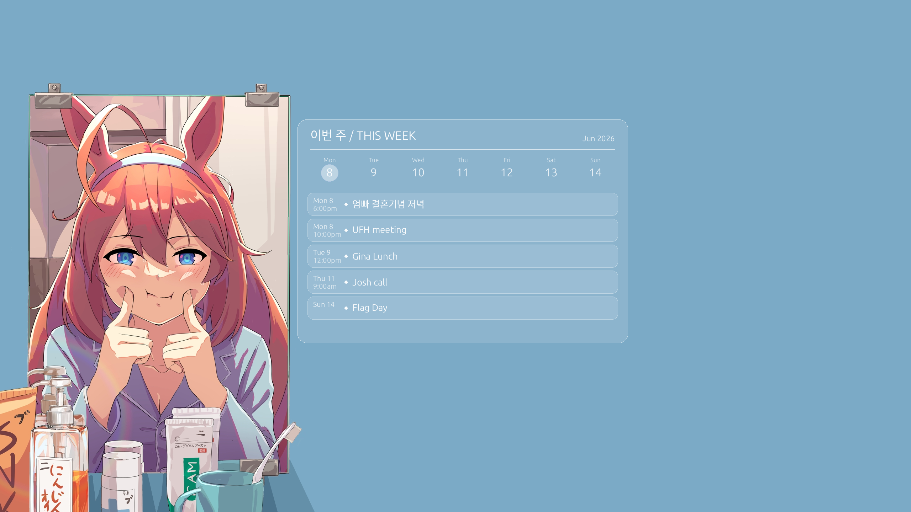

# GCal Background-Composited Widget for I3 (beta ver.)

A frosted glass Google Calendar widget for Linux desktops. Renders a PNG composited onto your wallpaper and refreshes every 5 minutes via a systemd user timer.

Shows the current calendar week in a day strip, plus the next 5 upcoming events from the next 7 days — filtered to only show events that haven't happened yet.



## Features

- Frosted glass panel composited directly onto your wallpaper
    - All colors and settings configurable via `config.env` (no Python editing required)
- Week strip with today highlighted
- Up to 5 upcoming events, current time onward, 7-day lookahead window
- Korean/CJK text support (Noto Sans CJK)
- Dry-run mode with fake events for testing without gcalcli

## Dependencies

**System packages**

```
sudo apt install feh python3-pillow fonts-ubuntu fonts-noto-cjk
```
* Noto-cjk for Chinese/Japanese/Korean text. Configure with any desired language. **May require extra centering configuration via `vcenter_y()` calls in `render_widget()` or `anchor="ls"` baseline in header block**

**Python**

```
pip install pillow
```

**gcalcli**

```
pip install gcalcli
```

## Setup

### 1. Clone

```
git clone https://github.com/JooshJin/GCal-Widget-i3 ~/.config/gcal-widget
```

### 2. Authenticate gcalcli

You need a Google OAuth client ID. Follow the [gcalcli OAuth setup](https://github.com/insanum/gcalcli#google-calendar-api) to create credentials and place `client_id.json` in `~/.config/gcalcli/`.

Then authenticate:

```
gcalcli agenda
```

Complete the browser OAuth flow. After this, gcalcli runs headlessly.

### 3. Configure

```
cp ~/.config/gcal-widget/config.env.example ~/.config/gcal-widget/config.env
```

Edit `config.env` with your preferred settings — position, calendars, colors, font paths. This file is gitignored so your personal values are never committed.

### 4. Copy your wallpaper

```
cp /path/to/your/wallpaper.png ~/.config/gcal-widget/wallpaper.png
```

### 5. Make the script executable

```
chmod +x ~/.config/gcal-widget/update_widget.sh
```

### 6. Install the systemd timer

```
mkdir -p ~/.config/systemd/user
cp ~/.config/gcal-widget/gcal-widget.service ~/.config/systemd/user/
cp ~/.config/gcal-widget/gcal-widget.timer ~/.config/systemd/user/
systemctl --user daemon-reload
systemctl --user enable --now gcal-widget.timer
```

### 7. Wire up i3

Remove any existing `feh` wallpaper lines from your i3 config and add:

```
exec --no-startup-id ~/.config/gcal-widget/update_widget.sh
```

This sets the wallpaper on login; the timer handles updates every 5 minutes after that.

### 8. (Optional) Enable linger for auto-start before login

```
loginctl enable-linger $USER
```

## Configuration

All settings live in `config.env` (gitignored). Copy from the example and edit:

```
cp config.env.example config.env
```

| Key | Default | Description |
|---|---|---|
| `WIDGET_W` / `WIDGET_H` | 1000 / 700 | Widget size in pixels |
| `WIDGET_X` / `WIDGET_Y` | 800 / 300 | Position on screen |
| `GCAL_CALENDARS` | *(empty)* | Comma-separated calendar names to show; empty = all calendars |
| `FONT_*` | Ubuntu fonts | Paths to TTF/OTF font files |
| `COL_*` | Blue-grey theme | Colors as `R,G,B,A` (0–255) |

Also update the matching `WIDGET_*` variables in `update_widget.sh` if you change the widget position.

## Testing

Preview with fake events (no gcalcli required):

```
python3 gcal_widget.py --dry-run
```

The output is written to `~/.config/gcal-widget/widget_overlay.png` by default.

Run with a specific wallpaper:

```
python3 gcal_widget.py --wallpaper ~/Pictures/wallpaper.png --output /tmp/preview.png
```

Check the service log:

```
tail -f ~/.config/gcal-widget/widget.log
```

## Fonts

Default font paths are for Ubuntu/Debian:

- **Ubuntu** — `fonts-ubuntu` package (`/usr/share/fonts/truetype/ubuntu/`)
- **Noto Sans CJK** — `fonts-noto-cjk` package (`/usr/share/fonts/opentype/noto/`)

If you're on a different distro, update the `FONT_*` paths in `config.env` to point to equivalent fonts.
